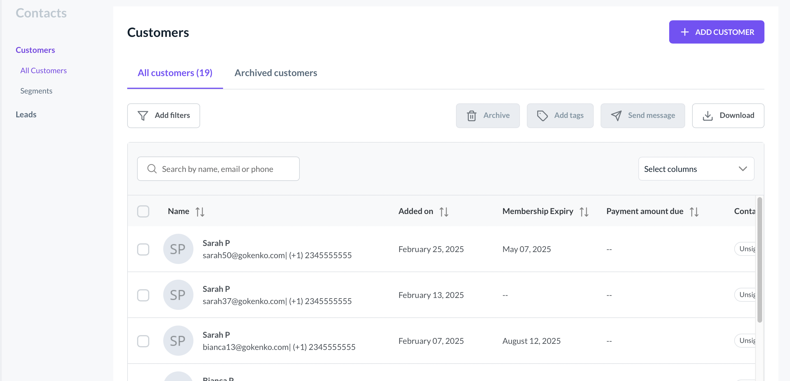

# Contact Management Introduction

Kenko’s **Contact Management** module is designed to offer fitness and wellness businesses a streamlined solution for managing both **Leads** and **Customers**. It helps organize contacts efficiently and track their journey through your services, ensuring smooth interactions and record-keeping.

## Key Capabilities

Manage customer details like membership status, contact information, payment history, and service usage. Manage potential customers in the introductory stages like trial memberships or promo offers. Track leads through different stages like New, Trial, Follow-up, and Interested. Upload important documents like waivers, signed forms, or contracts to profiles.

## Leads vs. Customers

Understanding the difference between **Leads** and **Customers** helps you optimize your efforts in nurturing and managing each contact type

Leads are prospects in the \*\*introductory offer\*\* or \*\*trial membership\*\* phase. They have not yet made a purchase, and your goal is to convert them into paying customers through follow-ups and marketing campaigns. Customers have \*\*active memberships\*\* or \*\*bookings\*\*. They have made a purchase, signed up for memberships, or booked sessions. They are fully integrated into your business's operations.

### Key Differences

**Leads**: Primarily for individuals who are in the trial phase or interested in the intro offer.

**Customers**: Individuals with atleast on active Subscription ( Not Credit Packs ) and atleast on booking in place.

## 

## Lead Pipeline Management

Kenko’s **Lead Pipeline** enables efficient management and tracking of leads as they progress through various stages.

1. **New Leads**: Fresh prospects who have shown interest. Businesses can assign leads to team members for further nurturing.
2. **Follow-Up**: Leads that require follow-up actions to convert them into customers.
3. **Will Buy Later**: Leads that are interested but need more time before making a decision.

Track leads through the pipeline and move them between stages based on progress. Manage and automate follow-ups to nurture leads and convert them to active customers. Additional Lead stages can be added according to business requirements from Settings \\> Leads

### Customer Profile Components

The **Customer Profile** in Kenko CRM contains all the necessary information for managing customer interactions effectively. The key components of a customer profile include:

Includes personal details such as name, email, phone number, address, and membership status. Displays active membership, payment history, membership expiration date, and due payments. Easily add related contacts, such as family members or referrals, and link them to the customer profile. Upload important customer documents like signed waivers, contracts, or liability forms directly to the profile. Booked sessions information including classes, appointments and course session. Check who has been referred by your customer and what rewards they received.

### Customer Segments

Kenko lets you organize and understand your audience by segmenting customers based on their Activity, Memberships, and Attributes. This helps tailor communication and improve engagement.

Customers details like name, contact info, birthday, gender and contact tags Customers who have made purchases, and various other payment attributes. Contact's activity information including Visits, Bookings and Cancellations. Members and their respective pricing options attributes.

You can these segments to send targeted campaigns or as a part of Journeys ( Automated workflows ).

### 

### Additional Features

Kenko CRM also includes various features to streamline contact management:

* **Custom Filtering and Searching**: Quickly find customers or leads based on different criteria such as name, membership status, and more.
* **Bulk Actions**: Perform actions such as archiving, adding tags, or sending messages to multiple contacts at once.

By using the **Contact Management** module, businesses can efficiently manage and track both leads and customers, ensuring all customer journeys are well-documented and nurtured.

The integration of leads into the pipeline and easy access to customer profiles ensures that businesses can maximize their sales and operational efficiency.
