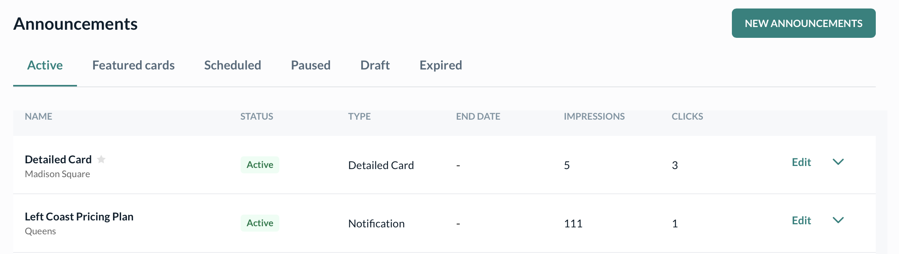

# Announcement Setup

Kenko's **Announcements** module helps studios communicate key updates directly inside the app — from schedule changes and location-specific promotions to event launches and emergency alerts.

These announcements appear in your clients' app and can be shown as

Best for event promotions, class updates, and anything with detailed content. Appears on the home screen with image and description. Ideal for short alerts or urgent messages. Appears above home screen sections. Great for nudging inactive users or highlighting new launches. Pops up on user's mobile lock screen.

Each announcement includes live preview functionality so you know exactly how it will appear to users.

## Announcement Creation Flow

When creating a new announcement, you'll move through 3 steps

Navigate to \*\*Marketing \\> Announcements \\> Create new\*\*



Decide the format of your announcement: \*\*Detailed Card\*\*, \*\*Banner\*\*, or \*\*Push Notification\*\*.

```
<Note>
  Add Announcement name for internal indentification
</Note>


Choosing a location for the Announcement restricts it to the location view.
```

Add your content including the title, short summary, rich description, image, and an optional CTA button in case of detailed cards and Banner.

```


Fill in all required fields

| Field             | Description                                             |
| ----------------- | ------------------------------------------------------- |
| Title             | Appears at top of announcement. Max 36 characters.      |
| Short Description | One-liner shown on the home screen. Max 48 characters.  |
| Main Description  | Rich text field with full message.                      |
| Image             | Visual to accompany the card (min 375x168px, max 10MB). |
| CTA Button (opt)  | Add label and link to landing page or external URL.     |
```

Set which users should see the announcement, and control start/end dates. You can optionally send a push notification as well.

```


Choose who sees the announcement and when

- **Audience**: All users 
- **Start & End Date**: Select show dates and time
- **Push Notification**: Optional toggle to alert users instantly
```

Live preview of how it will look like on the app populates on the right hand side of Announcements setup

## Status and Management

Once live, announcements are categorized into tabs:

* **Active**: Currently shown to users
* **Featured Cards**: Highlighted cards
* **Scheduled**: Set to publish later
* **Paused/Draft/Expired**: Not visible to users

Track performance using **Impressions** and **Clicks** to measure engagement.

Kenko Announcements reach your audience \*\*inside your app\*\* — ensuring visibility without needing email or SMS.

## Best Practices for Announcements

Titles and short descriptions should be concise. Capture user attention in a single glance. Always upload a clear, brand-consistent image. Maintain the minimum dimensions (375px x 168px) to ensure optimal rendering. Schedule announcements to match your studio’s operational rhythm — avoid off-hours and target active app usage times. Include a Call to Action when driving bookings, offers, or website visits. Keep CTA text action-oriented like “Join Now” or “See Schedule.” Use Kenko’s live preview to verify how your message looks across formats — banner, card, and push.
