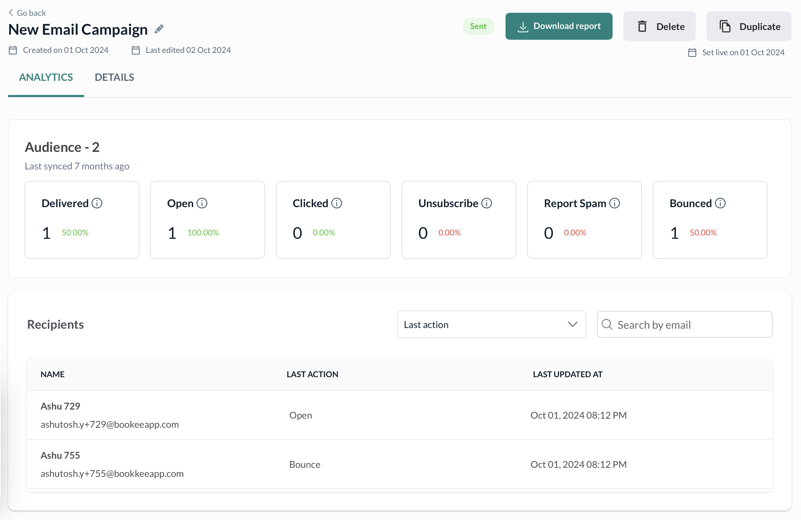

# Campaign Analytics

After launching an email campaign in Kenko, you can track its effectiveness directly from the **Analytics** tab. This view breaks down key metrics and recipient activity to help you optimize future sends.

## Performance Metrics Explained

Each campaign report begins with a high-level summary of delivery and engagement

| Metric          | Definition                                                                     |
| --------------- | ------------------------------------------------------------------------------ |
| **Delivered**   | Number and percentage of emails that successfully reached recipients’ inboxes. |
| **Open**        | Number and percentage of recipients who opened the email.                      |
| **Clicked**     | Number and percentage of recipients who clicked on a link in the email.        |
| **Unsubscribe** | Number and percentage of recipients who opted out of further emails.           |
| **Report Spam** | Number and percentage of recipients who marked your email as spam.             |
| **Bounced**     | Number and percentage of emails that were rejected and didn’t reach the inbox. |

These stats help you diagnose delivery issues (like high bounce rates) or engagement problems (low open/click rates).

## Audience Insights

Beneath the performance summary, Kenko lists all recipients of the campaign with contextual activity logs.

| Column              | Meaning                                                               |
| ------------------- | --------------------------------------------------------------------- |
| **Name**            | Contact name (if saved in Kenko)                                      |
| **Email**           | The recipient's email address                                         |
| **Last Action**     | The last known interaction with the email (Open, Click, Bounce, etc.) |
| **Last Updated At** | Timestamp when the latest interaction was tracked                     |

You can also filter recipients by interaction type using the **Last Action** dropdown or search specific emails.

## Actions You Can Take

Export campaign analytics to CSV for audits, deeper analysis, or CRM syncing. Reuse the same email configuration and content for a future campaign with one click. Remove the campaign permanently if it was a test or no longer needed.

***

Analytics reflect only users who received the campaign and had valid opt-in status at send time. If you see a high bounce rate, verify that your email domain is authenticated in \`Settings > Email Configuration\`. Want to improve open rates? Test different subject lines and preview text using A/B variations.
