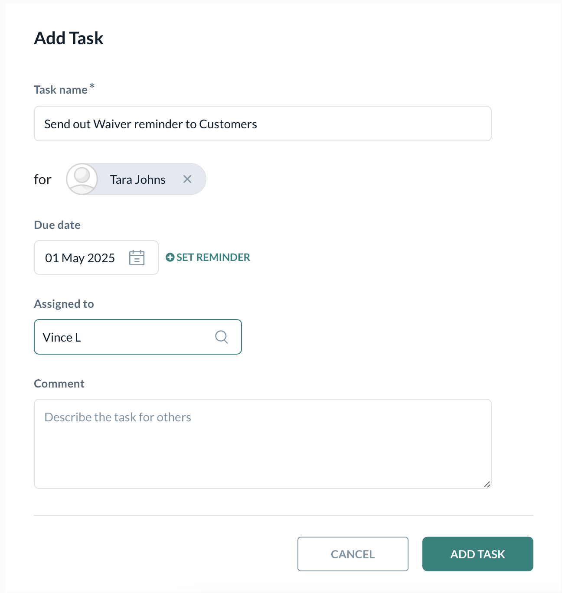

# Task Management

import { Card, CardGroup, Steps, Step, Accordion, AccordionGroup } from '@mintlify/components'

## Create Tasks for Studio Ops

Task Management in the system enables effective delegation, tracking, and completion of work-related activities by staff members. Tasks can be created, assigned, reminded, and tracked to ensure accountability and timely delivery.

### Creating a Task

To add a new task, users fill out the following fields

* **Task name**: Enter a descriptive name for the task.
* **For**: Specify the contact or person related to the task (optional).
* **Due date**: Select the deadline for the task to be completed.
* **Set Reminder**: Add a reminder notification for the due date.
* **Assigned to**: Choose the staff member responsible for completing the task.
* **Comment**: Provide additional details or instructions about the task.



### Task Filtering and Tabs

The task list can be filtered by

* **All**: Shows all tasks regardless of status.
* **Active**: Displays only tasks pending completion.
* **Completed**: Shows tasks that have been marked done.

These filters are accessible via tabs at the top of the task list for easy navigation.


### Managing Tasks

Use the "Add Task" button to open the task creation form. Fill all required fields and assign the task to a staff member. Monitor active tasks via the task list, with real-time status updates and upcoming due dates. Mark tasks as completed when finished. This updates the task status and moves it to the completed tab.

```

```

### Best Practices

Ensure every task has a clear, concise name and detailed comments so assignees know exactly what is expected. Always assign tasks to the most appropriate staff member based on skills and workload. Avoid overloading team members by setting achievable deadlines with built-in reminders. Leverage the reminder functionality to reduce missed deadlines and keep tasks on track. Frequently check active tasks to ensure progress and intervene when bottlenecks arise.
