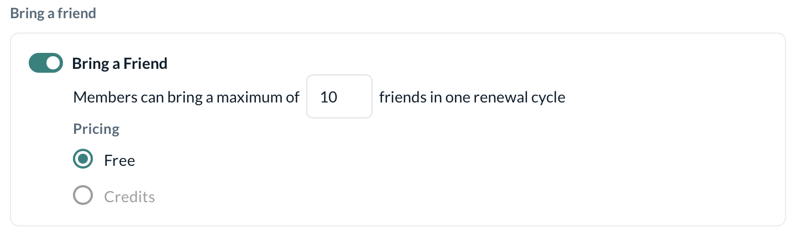
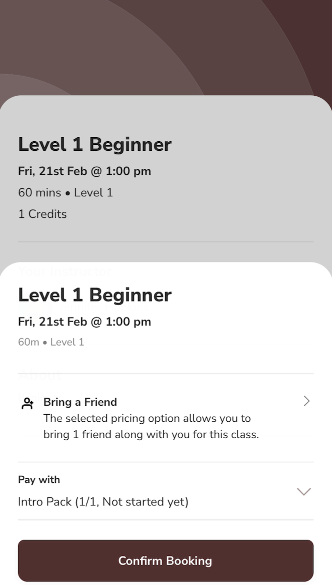

# Bring A Friend

Want your customers to share their favorite fitness class or appointment with a friend? The **Bring a Friend** feature in Kenko CRM makes it easy for customers to invite their friends to join them in a session. You get hot new leads, and your customers get to enjoy their favorite workout with their buddies!

## Getting Started

To set up this feature, follow the steps below

Go to \*\*Setup\*\* from the sidebar in the Kenko CRM and select \*\*Pricing Options\*\*.

```
<div className="flex justify-center mt-4">


</div>
```

Under \*\*Pricing Option\*\*, enable the \*\*Bring a Friend\*\* feature for a new or existing Membership.

```
<Note>
  This feature can be enabled only for **Credit Packs** and **Subscriptions**.
</Note>
<div className="flex justify-center mt-4">


</div>
```

## Subscription Setup for Bring a Friend

### Subscriptions

#### i) Limited Credits

For limited credit subscriptions, you can either allow free purchases or charge for each friend brought, with credits being deducted based on the class or appointment.


#### ii) Unlimited Credits

For unlimited credit subscriptions, **only free pricing** is allowed, as credit-based deductions do not apply here.

The "Bring a Friend" feature resets every subscription renewal cycle. For example, if a customer has 2 unused buddy passes from a previous month, they will start with 4 passes in the next cycle.

### Credit Packs

The conditions for **Limited Credit Packs** and **Unlimited Credit Packs** are similar to subscriptions, with one key difference: for Credit Packs, the quota for buddy passes lasts until the **Credit Pack's expiry**.


## How Does it Appear for Your Customers?

Once customers have access to the **Bring a Friend** feature, they will be able to invite friends when booking a class or appointment.

### Website Widget View

Customers will see a prompt indicating whether they can bring a friend based on their purchased pricing option.


After choosing to bring a friend, customers will need to enter the friend's details, which will be saved in the CRM as a lead.

It’s a good idea to mention "Bring a Friend" in the description of the Pricing option for better visibility to customers.

## Customer App View

The **Bring a Friend** feature also works in the Customer App. Customers can invite their friends while booking a session. The process is similar to the website widget experience.



## Important Notes

* **Friend's Details Saved in CRM**: When customers add their friends, the friend's details will be saved in the CRM as a lead.
* **No Email Check**: Currently, we do not check whether the friend's email already exists in our CRM, so a friend can be added multiple times.

### Post-Booking Process

Once the booking is confirmed, both the customer and their friend will receive a booking confirmation with their assigned spots. They will be able to view their upcoming bookings under **Account > Upcoming Bookings**.

\*\*Note\*\*: Customers can also book a class or appointment through the \*\*Customer App\*\* along with their friends joining them using the \*\*Buddy Passes\*\*.

## Bring a Friend and Spot Booking

Customers can book a spot for themselves and their friends in their favorite classes based on the membership they have purchased. The **Bring a Friend** feature extends to spot booking, allowing customers to book a place for both themselves and their friend(s) for a class or appointment.

### Key Points

**Spot Booking for Friends**: Customers can use their **Bring a Friend** passes to book a spot for their friends in the class or appointment.

*   **Enter Friend's Details**: The main customer has to enter the details of the friend they wish to bring. Once the friend’s details are entered, the **facility layout** will open for spot selection.

    The main customer can only access this benefit if their membership plan allows \*\*Bring a Friend\*\*.
* **Choose Spot for Themselves and Friends**: After entering the details, the customer will be able to choose spots for both themselves and their friend(s) in the class.
* **Confirmation**: After the booking is confirmed, both the main customer and their friend will receive a booking confirmation email with their assigned spots for the class.

This feature is only available if the \*\*Bring a Friend\*\* option is part of the purchased membership. Ensure that the customer has a valid membership that supports this feature to be able to bring a friend and book spots.

## Cancellation of Bookings Using Bring a Friend

### Canceling the Booking

If a customer cancels their own booking, their friend's booking will also be canceled. Friends cannot attend without the main customer who has purchased the membership and booked the session.

\- \*\*Fee Charged\*\*: If a fee is charged, the customer holding the membership will pay the cancellation fee for all non-attendees. - \*\*Credits Charged\*\*: Credits will be deducted for the customer and their friends from the membership. - \*\*Both Fee and Credits Charged\*\*: The customer will incur a fee and credits will be deducted for both the customer and their friends. - The customer holding the membership is the only one charged the cancellation fee. - No charges will apply to anyone if the cancellation is free.

## No-Show Charges for Bring a Friend Bookings

No-show charges are similar to cancellation charges for **Bring a Friend** bookings:

\- Credits will be deducted from the main customer's account for all non-attendees. - The main customer will pay the no-show fee for all non-attendees. No-show fees will be charged immediately if a card is saved, or as an amount due if no card is saved. If a friend decides not to attend but the main customer attends, the no-show fee will only be charged for the friend, and only if credits are used.

## Feature Availability and Scope

\- The \*\*Bring a Friend\*\* option is available for \*\*Classes\*\* and \*\*Appointments\*\*. - The feature will only be visible to customers if their membership allows it. - Customers can access this feature through both the \*\*website widget\*\* and the \*\*customer app\*\*. - \*\*Bring a Friend\*\* can only be set up through the \*\*Pricing Options\*\* in the CRM.

## Booking Constraints and Limitations

\- \*\*Bring a Friend\*\* cannot be used with \*\*Quick Pay\*\* because it is tied to a membership. - \*\*Bring a Friend\*\* does not apply to free classes or appointments since no membership is required for booking. - \*\*Bring a Friend\*\* cannot be used for sessions that require multiple credits. This is a future enhancement we are considering. - To use \*\*Bring a Friend\*\*, all credits must come from a single pricing option. Combining multiple plans for a booking is not supported. - \*\*Book for Someone Else\*\* cannot be used in combination with \*\*Bring a Friend\*\*. The latter relies on the customer's own membership, while the former uses the plan of the person being booked.

## Best Practices

Highlight the \*\*Bring a Friend\*\* feature in your pricing descriptions to ensure customers know about the benefits of inviting their friends. Keep an eye on \*\*Buddy Pass\*\* usage to ensure the feature is being used within its limits, and to manage how many friends can be brought per cycle. Make sure the rules around \*\*Bring a Friend\*\*, including cancellation and no-show fees, are clearly communicated to your customers. Encourage your customers to share the \*\*Bring a Friend\*\* option on social media to increase engagement and attract new members. Use CRM tools to track the number of \*\*Bring a Friend\*\* bookings and measure the feature's success in attracting new customers.

***
