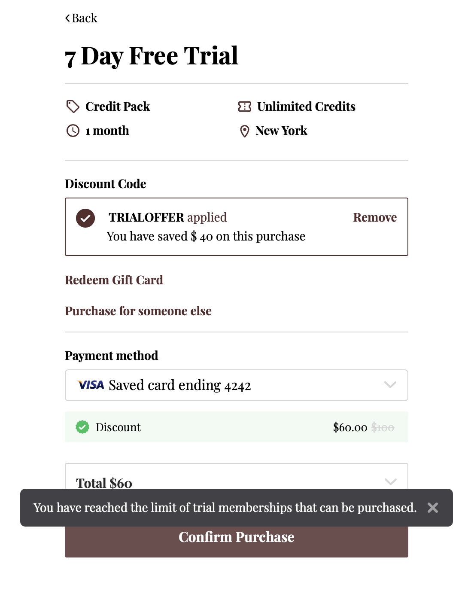

# Intro Packs

Intro Packs are a game-changer for fitness studios, offering a low-cost, commitment-free way to attract and convert new customers. These packs help studios showcase their value, build trust, and turn first-time visitors into long-term members.

## Getting Started

To set up Trial Packs/Intro Offers in Kenko's CRM, follow these steps

Go to \*\*Setup\*\* from the sidebar in the Kenko CRM and select \*\*Pricing Options\*\* \\> \*\*Credit Packs\*\*. Click on the \*\*Create Plan\*\* button, select Credit Packs, and fill in the basic details of the Intro pack.

```
<div className="flex justify-center mt-4">


</div>

<Note>
  Toggle on **Trial Membership** to convert the Credit Pack into an Intro offer.
</Note>
<div className="flex justify-center mt-4">


</div>
```

To convert an existing Credit Pack into a Trial Pack, select a Pricing option from the list, click on \*\*Edit\*\*, and enable the \*\*Trial Pack\*\* option.

```
<Note>
  Only Credit Packs can be converted into Trial Packs.
</Note>
<div className="flex justify-center mt-4">


</div>
```

## Trial Pack Usage Settings

Trial Packs can be used to attract new customers by offering discounted or free services. However, to avoid misuse, it is essential to set restrictions on how many Trial Packs a customer can purchase.

To set up the purchase limit for Trial Packs, navigate to \*\*Settings\*\* \\> \*\*Payments\*\* \\> \*\*General\*\*. Under \*\*Global Trial Pack Settings\*\*, define the number of Trial Packs that can be purchased within a set time period.

```
<Note>
  Default: "Members can purchase 1 Trial Pack in 1 year per Business."
</Note>
<div className="flex justify-center mt-4">


</div>
```

## Customizing Trial Pack Usage

There are several customizable options for Trial Packs, including duration, purchase limits, and levels of application.

Set how many months or years the purchase limit of the Trial Pack should apply. The maximum limit is 30 months/years.

```
<div className="flex justify-center mt-4">


</div>
```

Customize how Trial Packs can be purchased by setting the purchase limit at different levels. Below are the options

```
**Business Level**: If set to Business level, the setting applies to all Trial packs across all regions and locations in the business.

Example: If the setting is “Members can purchase 2 Trial Packs in 1 month per Business,” then customers can only purchase a total of 2 Trial packs at any location across all regions in one month.

**Region Level**: If set to Regional level, the setting applies to all locations within a specific region.

Example: If the setting is “Members can purchase 2 Trial Packs in 1 month per Region,” customers can purchase a total of 2 Trial packs across all locations within the same region in one month. Total purchases possible = Total regions x 2.

**Location Level**: If set to Location level, the setting applies to individual locations.

Example: If the setting is “Members can purchase 2 Trial Packs in 1 month per Location,” customers can only purchase a total of 2 Trial packs at one location in a month. Total purchases possible = Total locations x 2.

<Note>
  When configuring the settings, consider the business structure, and how widespread the limits should be across regions and locations.
</Note>
<div className="flex justify-center mt-4">


</div>
```

### Example Reference Table

Consider a business with two regions and multiple locations. If each setting allows a maximum of 3 Trial Packs per month, here’s how the limits work:

| Limit Type     | Allowed Purchases | Where Can They Purchase?        | Not Allowed Purchases               | Total Purchases Possible |
| -------------- | ----------------- | ------------------------------- | ----------------------------------- | ------------------------ |
| 3 per Location | 3 per location    | Any location (L1-L6)            | 4 or more at any single location    | 18 (3 × 6 locations)     |
| 3 per Region   | 3 per region      | Any 3 locations within a region | 4 or more in a single region        | 6 (3 × 2 regions)        |
| 3 per Business | 3 in total        | Any location (L1-L6)            | More than 3, regardless of location | 3 (business-wide limit)  |

## How It Appears for Your Customers

Once the Trial Pack limit is reached, customers will not be able to purchase further Trial Packs until the reset period is over.

### Website Widget

Customers will see a prompt indicating if they are eligible for the Trial Pack based on their purchase history.



### Customer App View

Customers can also see their eligibility for Trial Packs within the Customer App.


## Feature Availability and Scope

\- Trial Packs are available for \*\*Classes\*\* and \*\*Appointments\*\*. - Customers can access Trial Packs via the \*\*Website Widget\*\* and the \*\*Customer App\*\*. - Trial Packs can only be set up through \*\*Pricing Options\*\* in the CRM.

## Booking Constraints and Limitations

Trial Packs cannot be used with \*\*Quick Pay\*\* as they are tied to a membership. Trial Packs are not available for \*\*free classes or appointments\*\*. Trial Packs cannot be used for sessions that require multiple credits. This is a future enhancement we are considering. Trial Packs must come from a single pricing option. Combining multiple plans for a booking is not supported.

## Best Practices for Intro Pack Setup

Set clear limits on the number of Trial Packs a customer can purchase to avoid misuse. Highlight Trial Packs on your website and in your pricing descriptions to attract leads. Ensure that customers understand the restrictions and benefits of the Trial Pack. Use CRM tools to track how well Trial Packs are converting leads into full memberships. Create a sense of urgency by offering Trial Packs with limited availability.

***
