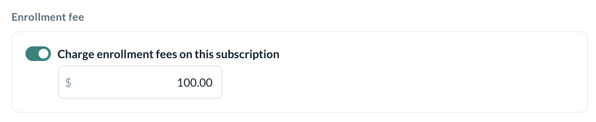

# Setup Subscriptions

Subscriptions are recurring type memberships that provide credits for service bookings in a recurring cycle.

## Creating a Membership

You can create a membership in Kenko by

Navigating to Sidebar \\> Setup \\> Pricing Options \\> Create new

You can also create a Group of Pricing options for better accessibility of Pricing options which can be grouped together.

Setting up subscription memberships in Kenko involves three main steps: defining **Basic Details**, setting **Expiry and Credits**, and configuring **Pricing Options**. In this guide, we’ll go through each step with an explanation of every detail.

## Basic Details

The first step is to define the **basic details** of your subscription plan. Here you will set the membership type, location, and related metadata.

You can choose from different membership types:

```
- **Subscription**: A recurring plan that automatically renews.
- **Credit Pack**: One-time credit packs that can be used for classes or appointments.
- **Top-Up Pack**: Add more credits to existing memberships.

<Note>
  This setup guide is for Subscriptions which are recurring in nature.
</Note>
<div className="flex justify-center mt-4">


</div>
```

\- \*\*Location\*\*: Select the location where the subscription can be purchased (e.g., a specific branch). - \*\*Plan Name\*\*: Set a descriptive name for the plan. It will appear to customers as they choose their membership.

```
<div className="flex justify-center mt-4">


</div>
```

Choose a Group for the Membership for easier access and add a description for your customers so that they can take an informed decision.

```
<Note>
  You should add all the perks that come bundled with the Subscription for better visibility.
</Note>
<div className="flex justify-center mt-4">


</div>
```

## Expiry and Credits

In this step, you'll define the subscription's expiry and any credits associated with the membership. This section includes setting the renewal period and any restrictions regarding the subscription.

\- \*\*Renewal Period\*\*: Set the period/Cycle for renewal, such as "Every 1 month". This is post which the credit balance gets reset to the original quantity ensuring customers keep enjoying the Subscription's benefits. - \*\*Maximum Cycles\*\*: Define the maximum number of cycles a membership can go through before it expires. i.e if you set "12 cycle" the Membership expires after that unless renewed otherwise.

```
<div className="flex justify-center mt-4">


</div>
```

\- \*\*Credit Roll-over\*\*: Enable the option to carry over unused credits to the next cycle. - \*\*Expiry\*\*: Set expiry for credits or memberships if they are not renewed within a specified time.

```
<div className="flex justify-center mt-4">


</div>
```

You can define if you want to include Booking credits with a subscription or not. You should consider the following scenarios to decide whether or not to enable it.

```
**Toggle ON**: Use when offering memberships that include access to classes or appointments or both as part of the plan, simplifying bookings for your members.

<div className="flex justify-center mt-4">


</div>

**Toggle OFF**: Use when you want to offer memberships without automatic class/appointment access, requiring customers to purchase credits separately for each booking.

<div className="flex justify-center mt-4">


</div>

If enabled, It is mandatory to choose a service the membership is applicable to. The service can either be classes, appointments, or both.

You can furthermore customize it for selected classes or appointments and whether or not customers can book unlimited sessions or session bookings should have a limit to it.
```

A subscription can have both Limited and Unlimited Credits, this implies that each cycle the customer will receive Unlimited credits or a set number of credits as defined by the subscription.

```
<div className="flex justify-center mt-4">


</div>
```

## Pricing

Now, set the pricing for the subscription, define cancellation policies, and set minimum cycle requirements.

\- \*\*Price\*\*: Enter the price for the subscription. The price can be set to recur monthly or for a custom period (e.g., weekly, quarterly). - \*\*Tax on Subscription\*\*: Optionally, you can enable the option to charge tax on the subscription amount.

```
<div className="flex justify-center mt-4">


</div>
```

\- \*\*Minimum Cycles\*\*: Set the minimum number of cycles a customer must commit to. If a customer cancels before completing these cycles, they will incur a charge.

```
<div className="flex justify-center mt-4">


</div>

- **Cancellation Fee**: Enable the option to charge a cancellation fee if the customer cancels before the minimum cycles are complete. You can also specify the amount to charge.

<div className="flex justify-center mt-4">


</div>
```

The cycle's billing date is the first of every month. In case the customer purchases in the middle of the month, they will be charged a pro-rated amount in the next billing date.

```
<div className="flex justify-center mt-4">


</div>
```

Enrollment fees are a one-time charge applied when customers first sign up for a subscription or membership. They help cover the initial processing costs or provide access to exclusive benefits. These fees can be set based on the subscription type or membership tier.

```
</div>
```

### Best Practices for Subscription Setup

Make sure customers know the minimum cycle commitment before they sign up to avoid any confusion later. Make sure your cancellation policies are easy to find and clearly communicated to customers to maintain transparency. Regularly monitor how customers are using their subscriptions and adjust your offerings to better meet their needs. Highlight features like 'Bring a Friend' to encourage referrals and increase membership engagement. Simplify the payment process to make it easy for customers to pay for their subscriptions and renew on time. Provide trial periods for new customers to test out your subscription before they fully commit.

***
