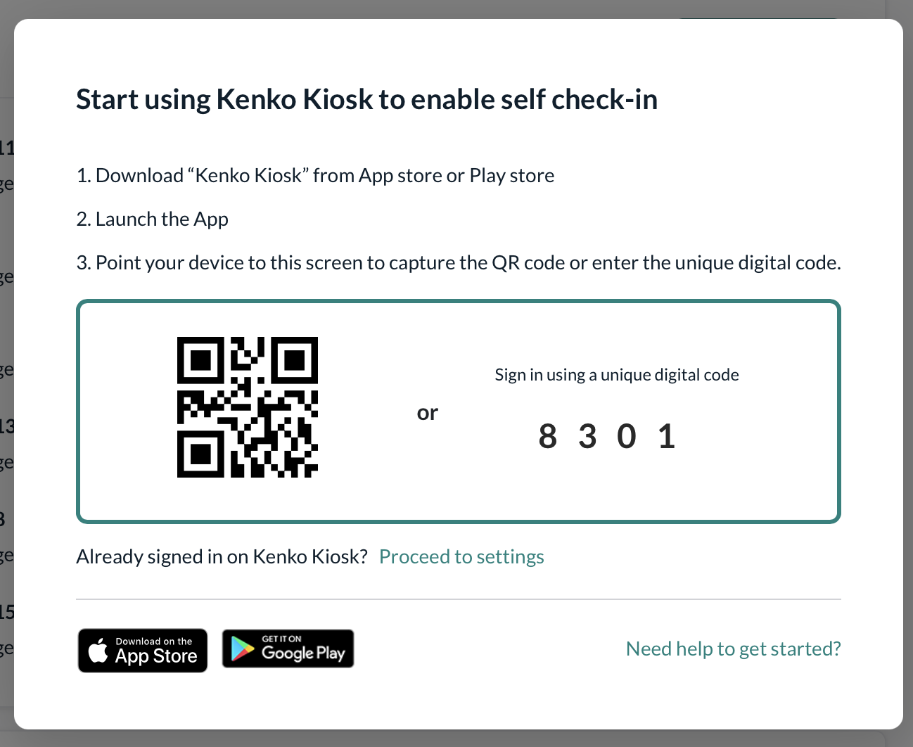
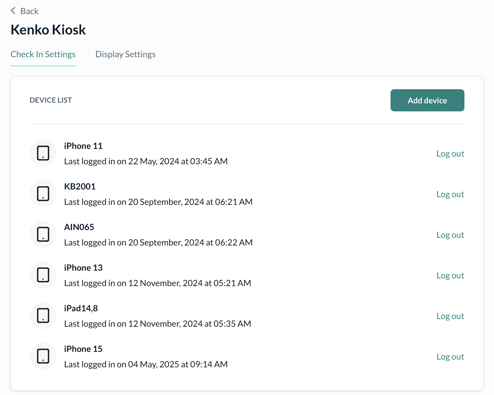
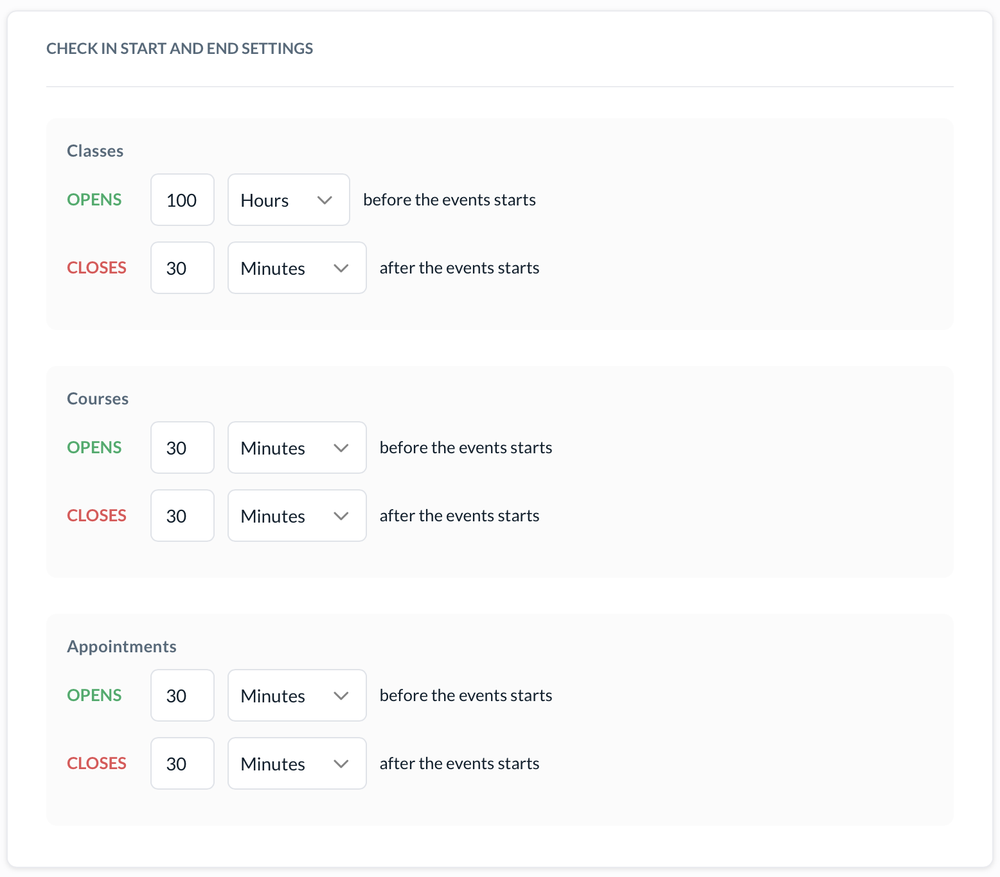
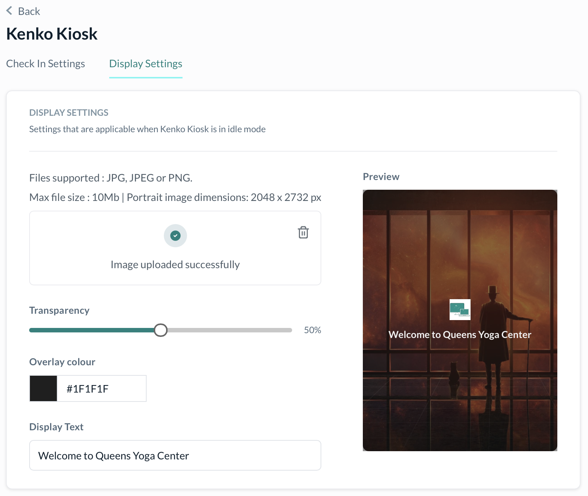

# Kiosk Settings

The **Kenko Kiosk** app is your studio’s self-check-in station — a frictionless way for members to mark attendance for classes, appointments, and courses using their own phones.

This article covers everything from pairing devices to fine-tuning check-in behavior and display aesthetics.

## Getting Started with Kenko Kiosk

1. **Download the Kenko Kiosk app** on any iOS or Android tablet/phone.
2.  Launch the app and either

    * Scan the on-screen QR code, or
    * Enter the **4-digit digital pairing code** manually.

    

## Device Management

Once a device is paired, it appears in your **Admin → Kiosk Settings** list. You can

* View device names and last login times
* Log out unused devices remotely
* Add new devices anytime



## Check-In Window Configuration

Kenko lets you define **when check-in opens and closes** for each event type



### Navigate to

`Settings → Kiosk → Check-In Settings`

Customize when the check-in time opens for classes on the Kiosk.

```
e.g.

- **Opens:** 100 minutes before start time of the Class
- **Closes:** 30 minutes after start time of the Class
```

Customize the check-in time for each course session Customize when clients can check-in for an appointment

## Idle Screen Display Settings

When your Kiosk is idle, you can customize the background and welcome message.

Navigate to

`Settings → Kiosk → Display Settings`

* Upload a custom **JPG or PNG image** (max 10MB)
* Adjust **overlay transparency**
* Set an overlay **text message** (e.g., “Welcome to Queens Yoga Center”)



## Tips for an Optimal Kiosk Setup

Keep the Kiosk running on a stable tablet that stays mounted at your front desk. Use dummy check-ins to verify the pairing and display behavior. Make sure the Kenko Kiosk app is updated to the latest version from the App Store or Play Store. Avoid downtime by ensuring the tablet is always charged or powered.

## Need Help?

Email us at [help@kenko.community](mailto:help@kenko.community) and we’ll guide you through setup step-by-step.
