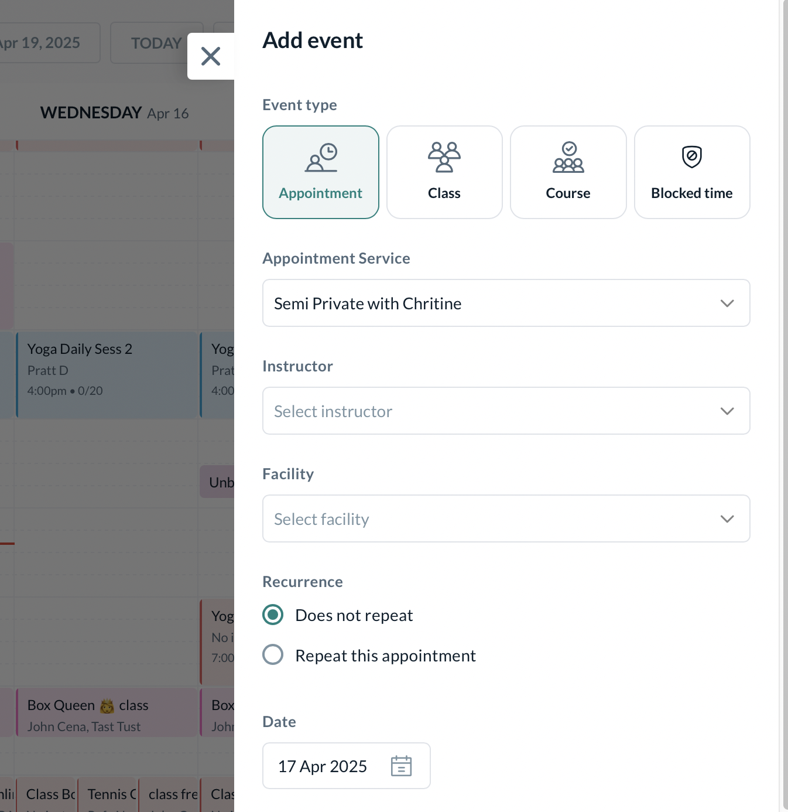

# Appointments Setup

Kenko's **Appointments** module allows you to offer personalized, 1-on-1 sessions in a structured and efficient manner. You can define services, attach instructors, limit capacities, and optionally map them to specific facilities. Appointments are highly configurable and suitable for various industries — from fitness to wellness to consulting.

## Appointment Lifecycle

Appointments can be managed from the CRM by

Navigating to \*\*Setup → Services → Appointment Services\*\*

You can do the following action items

* **Create**: Build appointment groups and define services within them.
* **Edit**: Modify service settings, instructor assignments, or pricing.
* **Remove**: Delete obsolete or inactive appointment types.

## Common Use Cases

Book 1-on-1 personal training sessions tailored to member goals. Offer body scan appointments using InBody or similar tools. Schedule physical therapy, injury rehab, or recovery sessions. Let members book time with certified nutritionists. Enable goal reviews, progress check-ins, or assessments. Provide massage therapy or stress-relief services.

## Appointment Configuration

Appointment setup is split into **2 stages** — Basic Details & Pricing.

### Basic Details

This is the primary label your customers will see when booking an appointment via the app or website.

```
Make it concise and relevant to the type of service (e.g., “15-min Physio Check” or “1:1 Nutrition Consult”).

<div className="flex justify-center">


</div>
```

Uploading a visual for your appointment helps it stand out in listings. Recommended image size is under 2MB. Use a representative image of the space, therapist, or service offered.

```
<div className="flex justify-center">


</div>
```

Categories help organize your appointments for both admins and customers. Examples include "Private Room", "Therapy", or "Nutrition".

```
<div className="flex justify-center">


</div>

<Note>
  To create a new category, go to **Settings → General Settings → Bookings → General**.
</Note>
```

Add a brief yet informative explanation of the appointment’s purpose. This will show up on tooltips and the customer app/web when booking.

```
<div className="flex justify-center">


</div>
```

Define how many clients can book the appointment slot. For most 1-on-1 services, this will be set to 1. For partner sessions, increase accordingly.

```
(Appointments with more than 1 attendee are called Semi-Private sessions)

<div className="flex justify-center">


</div>
```

Toggle this on if the appointment is delivered virtually. Kenko can generate Zoom links automatically (if integrated under Apps). You can also add links manually.

```
<div className="flex justify-center">


</div>
```

Assign eligible instructors who can be booked for this appointment. You can also let customers choose their preferred instructor during booking.

```
<div className="flex justify-center">


</div>
```

Assign a facility (e.g., Room A, Massage Table 1) where this appointment takes place. Kenko prevents scheduling conflicts by cross-checking overlapping events.

```
<Note>
  Facility selection is disabled for **online appointments**.
</Note>
<div className="flex justify-center">


</div>
```

Add conditions that customers must meet before they can book. For example, restrict appointments to users tagged "PT Level 2" or exclude "Newbies".

```
<div className="flex justify-center">


</div>

### Pre-requisites Logic

| Rule       | Description                                             |
| ---------- | ------------------------------------------------------- |
| All Of     | Customer must have **all selected tags**                |
| Any One Of | Customer can have **at least one of the selected tags** |
| None Of    | Customer **must not have** any of the selected tags     |

Customers not meeting the conditions will see a message like:

> “Oops\! It seems you aren’t meeting the requirements for this appointment.”

Add a description to explain the logic (e.g., "Only available for returning clients who completed onboarding").
```

Link a policy that determines whether the customer is charged, refunded, or warned if they cancel too late or don’t show.

```
<div className="flex justify-center">


</div>
```

Choose how often appointment slots should appear. Common settings are 5, 10, or 15-minute intervals — giving flexibility in how frequently customers can book.

```
For example:

- 5 mins = Slots at 9:00, 9:05, 9:10...
- 15 mins = Slots at 9:00, 9:15, 9:30...

<div className="flex justify-center">


</div>
```

Control who sees this appointment:

```
- **Visible to customers**: Toggle to show/hide this offering
- **Featured Appointment**: Highlight on booking screens
- **Book for someone else**: Enable for dependents or guests

<div className="flex justify-center">


</div>

**Color Tag**: Use color to organize and visually differentiate appointments on the calendar.

<div className="flex justify-center mt-4">


</div>
```

Add buffer time before and/or after appointments to prevent back-to-back bookings. This is useful for setup, cleaning, or transitions.

```
Example: 5 mins before & 10 mins after.

<div className="flex justify-center">


</div>
```

Mark an appointment as \*\*Featured\*\* to pin it to the top of the booking list in your app or website. Ideal for promoting popular or seasonal services.

```
<div className="flex justify-center">


</div>
```

### Pricing

These appointments are offered at no cost to the customer. They are ideal for intro sessions, onboarding consults, or community events. No payment method is required during booking, making them frictionless for new clients.

```
<div className="flex justify-center mt-4">


</div>
```

Customers can pay instantly at the time of booking via available online payment methods. Useful for drop-in services or pay-as-you-go models. You can associate a fixed price and track payments inside Kenko CRM.

```
<div className="flex justify-center mt-4">


</div>
```

These require customers to use their membership or pack credits to book. You can configure how many credits are needed, allowing greater control over access for premium services or recurring check-ins.

```
<div className="flex justify-center mt-4">


</div>

<Note>
  Both Quick Pay and Credit Based Pricing can be set for an Appointment's Pricing simultaneously.
</Note>
```

## Appointment Types in Kenko

| Criteria                    | **Facility-led**                                                                | **Instructor-led**                                                                  | **Facility + Instructor-led**                                                              |
| --------------------------- | ------------------------------------------------------------------------------- | ----------------------------------------------------------------------------------- | ------------------------------------------------------------------------------------------ |
| **Definition**              | Appointment is tied to a facility only, no specific instructor is needed.       | Appointment is tied to a specific instructor only, no facility is assigned.         | Appointment depends on both a facility and an instructor being available at the same time. |
| **Use Case Examples**       | Infrared Sauna, Cryo Chamber, Tanning Booth                                     | Nutrition Consult, Therapy Session, Personal Training                               | Deep Tissue Massage, Physiotherapy with specialist in Studio B                             |
| **Booking Logic**           | Customer sees available time slots based on room or facility availability only. | Customer sees time slots based on instructor's calendar.                            | Customer sees time slots that match both instructor and facility availability.             |
| **Resource Conflict Check** | Facility conflict is checked, instructor is ignored.                            | Instructor conflict is checked, facility is ignored.                                | Both facility and instructor calendars are checked for conflicts.                          |
| **Customer Experience**     | Customer selects the service and time, no staff is shown.                       | Customer may select preferred instructor (if allowed) or pick from available slots. | Customer chooses a time where both staff and space are free, instructor name is shown.     |
| **Setup Requirements**      | Enable “Requires Facility”, Instructor toggle off                               | Enable “Requires Instructor”, Facility toggle off                                   | Enable both “Requires Facility” and “Requires Instructor”                                  |
| **Best Suited For**         | Equipment-based or room-only services without staff dependency                  | Personalized 1-on-1 services, therapy, training                                     | High-touch services needing private space and certified personnel                          |

## Appointment Slot Creation Logic

Kenko automatically generates bookable appointment slots based on a combination of configuration settings. Here's how each element plays a role:

This defines how frequently new slots appear for booking.

```
| Increment Setting | Example Slots Generated |
| ----------------- | ----------------------- |
| 5 minutes         | 9:00, 9:05, 9:10, 9:15  |
| 10 minutes        | 9:00, 9:10, 9:20, 9:30  |
| 15 minutes        | 9:00, 9:15, 9:30, 9:45  |

- Shorter increments offer more granular options for shorter services.
- Longer increments are ideal for appointments requiring more setup or turnaround.
```

The core duration of the appointment itself (e.g., 30, 45, or 60 minutes). Kenko ensures the duration fits within both resource and availability blocks.

```
If duration = 30 minutes and increment = 15 minutes, overlapping slots like these may appear:

- 9:00–9:30
- 9:15–9:45
- 9:30–10:00
```

Kenko supports adding buffer time before and after each service to allow for prep, cleanup, or transition.

```
| Buffer Type | Description            | Example                |
| ----------- | ---------------------- | ---------------------- |
| Pre-buffer  | Setup/prep time        | 5 minutes before start |
| Post-buffer | Cleanup/recovery/reset | 10 minutes after end   |

If a 30-minute service has 5 min pre-buffer and 10 min post-buffer, Kenko blocks 45 mins total.
```

Slots are only generated when required resources are simultaneously available:

```
- Instructor-led: Only checks instructor availability.
- Facility-led: Only checks facility availability.
- Facility \+ Instructor-led: Checks both calendars simultaneously (including buffers).
```

Each instructor and facility has defined working hours. Time outside this window is not eligible for slot generation. Instructors can also block out specific hours or days as unavailable which is known as Block Time. Slots are automatically suppressed if:

```
- They overlap with existing bookings (including buffers).
- They conflict with instructor or facility schedules.
- They fall outside allowed windows or working hours.
```

\- \*\*Service Duration\*\*: 30 mins - \*\*Pre-buffer\*\*: 5 mins - \*\*Post-buffer\*\*: 10 mins - \*\*Increment\*\*: 15 mins - \*\*Available window\*\*: 9:00 AM – 12:00 PM - \*\*Resources Required\*\*: Instructor \\+ Facility

```
**Generated Slots**:

- 9:00 – 9:45
- 9:15 – 10:00
- 9:30 – 10:15
- 9:45 – 10:30
- 11:15 – 12:00

Only if both the instructor and facility are available during the full buffered window.
```

## Appointments & Calendar

## Appointments and Calendar

Unlike Classes, **Appointments do not auto-populate on the calendar** when you create them from the Setup module. Instead, you must manually **add appointments** through the calendar interface.

Once you add an appointment to the Calendar, you will be immediately prompted to add a customer to the appointment.

This workflow offers maximum flexibility — allowing different instructors or facilities to offer the same appointment types across custom time windows.

Appointment availability must be defined per instructor or facility — they do not follow a global recurring pattern unless explicitly configured that way.

### What Customers See

* Customers will see available appointment **time slots** as set in the CRM in the mobile app or website widget.
* They can choose the service, instructor (if multiple options exist), and book instantly based on eligibility and pricing rules.


This setup ensures dynamic control over appointment timing while maintaining personalized booking flexibility for end users.

## Best Practices

Use service groups like “Private Rooms” to keep your offerings organized. Let customers pick who they want to book with for better personalization. Tag services with facilities to avoid double-booking. Differentiate appointment types on calendar with color tags.

***
