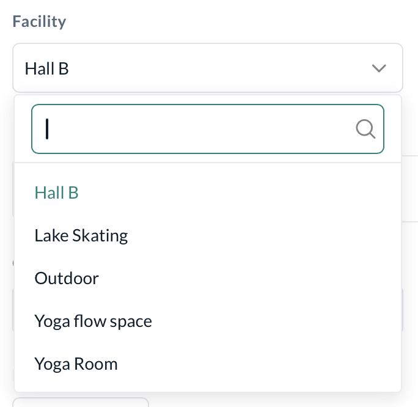
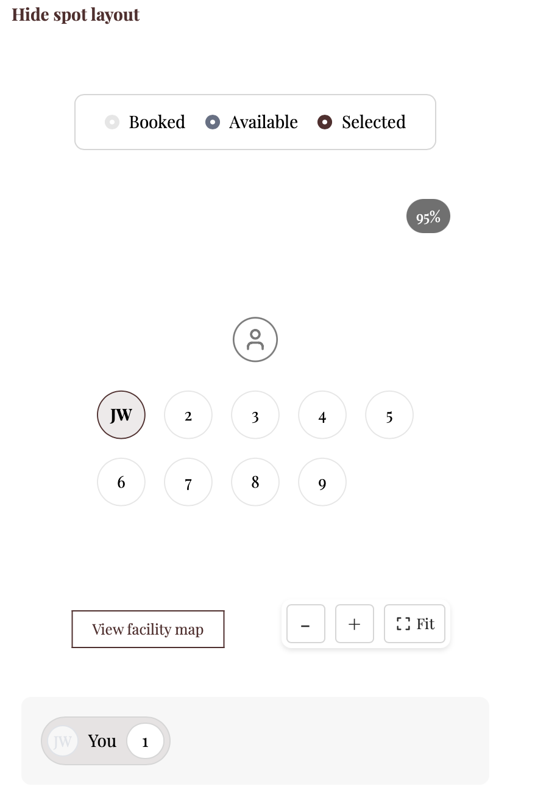

# Spot Booking Classes

import { Callout } from "@/components/mdx/callout" import { Card } from "@/components/ui/card" import { Steps, Step } from "@/components/mdx/steps" import { Accordion, AccordionGroup } from "@/components/mdx/accordion"

## Spot Booking in Classes

With the **Spot Booking** feature in Kenko CRM, you can offer a personalized booking experience. Whether it's a favorite Megaformer in a Lagree studio or a go-to bike in spin class — customers can now select their own spots before class begins.

Spot Booking is a premium feature. To enable it, please contact your rep or email \[support@bookeeapp.com]\(mailto:support@bookeeapp.com)

### Setting up Spot Booking in Kenko's CRM

#### Facility Setup

Navigate to \`Setup > Facility Creation\` in the CRM. Click \*\*Create Facility\*\* for a new one or select an existing one to edit.

```
<div style={{ display:"flex",justifyContent:"center" }}>


</div>
```

\*\*\_Basic Details\_\*\*

```
Provide the basic information about the facility (name, type, etc.) and upload an image to improve the booking interface for customers.

<div style={{ display:"flex",justifyContent:"center" }}>


</div>

**_General Availability_**

Add the availability of the facility to avoid any overlap or double events.

<div style={{ display:"flex",justifyContent:"center" }}>


</div>

**_Facility Layout_**

To enable Spot Booking, you need to configure the Facility layout as explained in the next steps.

<div style={{ display:"flex",justifyContent:"center" }}>


</div>
```

Go to the Layout tab of an existing/new facility and enable the \*\*Toggle\*\* to activate the Spot Booking feature.

```
<div style={{ display:"flex",justifyContent:"center" }}>


</div>
```

Set the layout capacity and column count. This determines the interactive layout your customers will see when selecting spots.

```
<div style={{ display:"flex",justifyContent:"center" }}>


</div>
```

Add a detailed layout image showing spot arrangement, instructor area, and any fixed equipment like racks or mirrors.

```
<Tip>
  You can use Canva to draw a Top view of the Facility so that your customers exactly have an idea of how it looks.
</Tip>
<div style={{ display:"flex",justifyContent:"center" }}>


</div>
```

Edit the spot label by double-clicking on the spot and adding letters or emojis to it.

```
_You can add up to 5 letters._

<div style={{ display:"flex",justifyContent:"center" }}>


</div>
```

If a class was created before Spot Booking was enabled, spots won't be retroactively applied to it. Only new or unbooked events will inherit the layout.

### Assigning Spots to Classes

To enable Spot Booking, you must assign a facility with Spot Booking enabled to your class. This applies to both newly created and existing classes.

#### Assigning a Spot-Enabled Facility to a New Class

When creating a new class inside Kenko:

1.  Start by filling in the basic class details — such as the name, instructors, description, and recurrence.

    
2.  While choosing the **facility**, be sure to select one that has the **Spot Booking toggle enabled** and a layout already configured.

    
3.  Once saved and published, the class will appear in both the admin calendar and your customer-facing app or website.

    From here on, customers booking this class will be able to choose their preferred spot through the Website or App.

    

> 💡 You can link multiple classes to the same facility — especially useful for studios with shared spaces like spin studios or group fitness halls.

#### Enabling Spot Booking on an Existing Class

If you're updating an already-created class to support Spot Booking:

* Make sure a **facility** is assigned to the class.
* Confirm that the selected facility has **Spot Booking enabled** and has a defined layout.

Once both of these conditions are met, new or **unbooked future sessions** of that class will inherit the layout and display available spots to customers at the time of booking.

### Publishing for Customer Booking

_Once Spot Booking is fully configured_

* Customers will see an **interactive facility layout** during booking.
* They can pick their preferred spot visually — whether that’s a front-row mat, a corner bike, or a zone near the mirror.
* If no spot is chosen, the system will automatically assign one based on availability.



### Customer Experience

Customers go through the following flow when booking a class with Spot Booking enabled:

```
a. **They view the class schedule** on a preferred date.

<div className="flex justify-center">


</div>

b. **They choose a class** from the available list.

<div className="flex justify-center mt-4">


</div>

c. They are shown a **live interactive layout** of the facility for that class. If the class's facility has Spot Booking enabled, they’ll be prompted to select a spot.

> If no selection is made, the system will auto-assign a spot based on availability.

<div className="flex justify-center mt-4">


</div>

d. **Customers choose their preferred spot** by tapping it.

e. For better orientation, they can **view the facility map** which displays the real-life layout (instructor zone, mirrors, entry, etc.).

<div className="flex justify-center mt-4">


</div>

f. Upon **booking confirmation**, the spot is shown in the upcoming bookings section, clearly marked with the selected position.

<div className="flex justify-center mt-4">


</div>
```

Kenko’s waitlist system supports both manual and automated modes:

```
- **Manual Notifications**: Everyone on the waitlist is notified when a spot opens.
- **Auto-Enrollment**: The system automatically books the next person in line when a spot becomes free.

In either case, a **spot is automatically assigned** based on real-time availability.
```

If a customer has access to \*\*Buddy Passes\*\* through their membership:

```
a. The customer can **add a friend** and proceed with booking.

<div className="flex justify-center mt-4">


</div>

b. Once details are added, the **facility layout opens**, showing available spots.

<div className="flex justify-center mt-4">


</div>

c. The main customer can select spots for both themselves and their guest(s).

> Note: This feature only works if the customer has an eligible membership that supports "Bring a Friend".

<div className="flex justify-center mt-4">


</div>

After booking, each friend receives a separate **confirmation email with their assigned spot**.
```

Spot Booking also supports scenarios where a customer books for a \*\*related contact\*\*, such as a dependent or another registered user:

```
a. The customer chooses a related contact from their linked profiles.

<div className="flex justify-center gap-4 mt-4">


</div>

b. The customer selects a spot on behalf of the contact.

<div className="flex justify-center mt-4">


</div>

> Once the booking is complete, the contact receives their confirmation along with their assigned spot.

If the contact does not have a valid membership, the system will **allow purchasing a membership during checkout** while still holding the selected spot.
```

Spot Booking is fully supported in the \*\*Kenko customer mobile app\*\* and \*\*website widget\*\*.

```
Customers get the same experience across both platforms, including:

- Interactive layouts
- Facility map previews
- Confirmation views with assigned spots

<div className="flex justify-center mt-4">


</div>
```

### CRM Visibility

Navigate to \`Calendar > \[A particular Class]\` to view the attendee list and assigned spots. Spot Booking will show seat assignments inline for each participant.

```
  
</Card>
```

When admins book clients manually, spots are auto-assigned. This also applies to recurring classes where spots will be allocated automatically for each participant.

### Third-Party Integrations & Spot Booking

Bookings made via integrations such as \*\*ClassPass\*\*, \*\*GymPass\*\*, and \*\*MyClubs\*\* are automatically assigned spots by the system. These users cannot manually pick a spot, as their selections are made by the platform based on availability.

***

### Feature Availability and Limitations

\- Spot Booking is only available for \*\*classes\*\*, not \*\*appointments\*\* or \*\*courses\*\*. - No custom labels or spot names are allowed yet (this is a future feature). - Admins cannot assign spots manually at the moment (feature coming soon). - Changing layout capacity \*\*resets existing bookings\*\* for that class.

### Best Practices

Set up your facility map and column structure \*\*before enabling the Spot Booking toggle\*\*. Once enabled, this becomes the base layout customers interact with. Use tools like Canva for a clear top-down view of your studio. Keep labels \*\*short and intuitive\*\* — up to 5 characters. Combine \*\*letters, numbers, or emojis\*\* (e.g., 🧘 A1, 💪 B3) to make spots easy to identify. This improves the customer experience and instructor visibility during check-in. Always select a \*\*Spot Booking-enabled facility\*\* during class creation. If you add a facility later, only unbooked future sessions will inherit the layout. Avoid retroactive edits to prevent inconsistencies. Upload a visual \*\*facility map\*\* that mirrors the real studio layout. This helps customers understand where each spot is in relation to the instructor, mirrors, or doors — especially in dark studios or packed rooms. Changing the \*\*layout capacity\*\* resets existing bookings. Finalize your layout first, then attach it to classes. If changes are needed, ensure all affected customers are notified. Try a hidden or internal-only class to preview how Spot Booking behaves. Book as a test user, check how the layout displays, and confirm the confirmation flow. This minimizes customer confusion when you launch. Make it clear to customers: if they don’t choose a spot, \*\*the system will auto-assign one\*\*. This keeps classes moving efficiently while giving flexibility to those who want specific locations.

***

Contact [support@bookeeapp.com](mailto:support@bookeeapp.com) to get Spot Booking enabled for your business.
